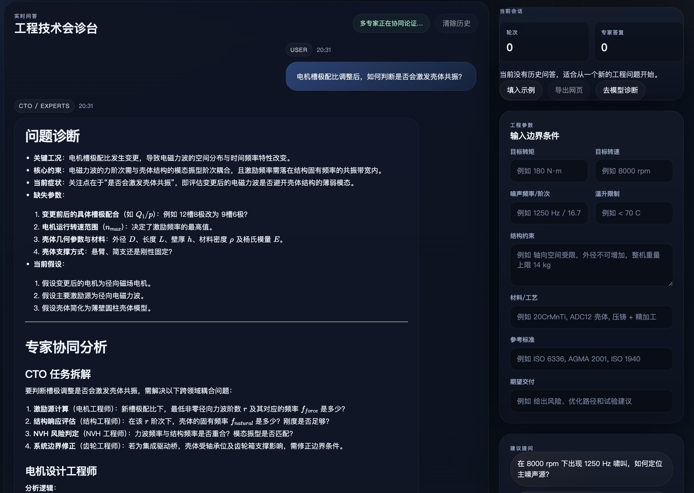
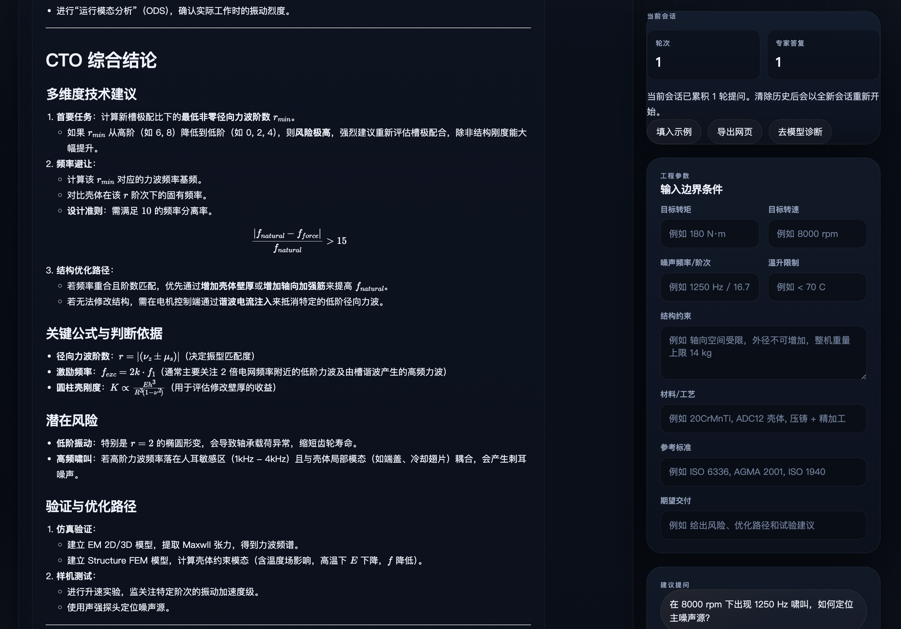
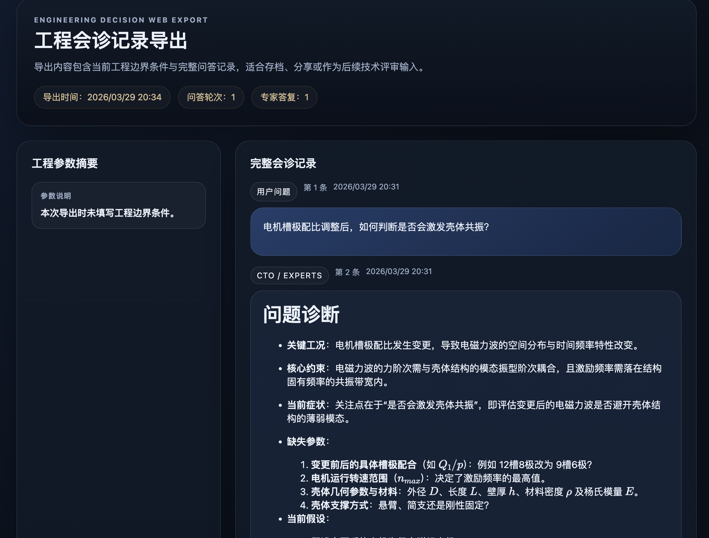

<div align="center">

# Engineering Decision Web

**A CTO-Orchestrated Multi-Expert Engineering Q&A System for Complex Electromechanical Systems**

[](https://nodejs.org/)
[](LICENSE)
[](https://open.bigmodel.cn/)
[](https://github.com)

[简体中文](README.md) · **English**

</div>

---

## Philosophy

In complex electromechanical system development, a single problem often spans electromagnetic design, structural integrity, gear transmission, and vibration acoustics. The traditional approach requires consulting domain experts separately, repeatedly aligning constraints, and manually synthesizing conclusions.

**Engineering Decision Web** brings this workflow to the browser: users input engineering problems and boundary conditions, and the system automatically **decomposes the problem from a CTO perspective**, dispatching four virtual experts (Motor Design, Structure, Gear, NVH) for collaborative analysis. The output is a structured engineering report with formulas, risk assessments, and verification paths.

---

## ✨ Features

### Multi-Expert Collaborative Decision Making

| Role | Domain |
|:---|:---|
| **CTO (Orchestrator)** | Problem decomposition, cross-discipline constraint identification, conflict resolution, synthesis |
| **Motor Design Engineer** | Electromagnetic design, winding topology, thermal management, magnetic circuits & materials |
| **Structure Engineer** | Strength, stiffness, FEA, tolerance chains, assembly & manufacturing feasibility |
| **Gear Engineer** | Tooth profile design, contact fatigue, meshing error, lubrication & transmission efficiency |
| **NVH Engineer** | Modal analysis, frequency response, vibration transfer, noise mechanisms & sound quality |

### Core Capabilities

- **Structured Parameter Panel** — One-click input for torque, speed, frequency, temperature rise, structural constraints, materials, and more
- **Real-time Streaming Responses** — Server-Sent Events for character-by-character delivery of engineering reports
- **Markdown + LaTeX Rendering** — Professional typesetting with formula support, e.g. $f_m = \frac{nz}{60}$
- **Server-side API Proxy** — API keys are securely stored on the server, never exposed to the browser
- **Mock Mode** — Full UI and interaction testing without a real API key
- **Multi-turn Conversation** — Continuous follow-up questions with automatic context carry-over
- **Model Diagnostics** — Dedicated page for API connectivity, latency, and response quality checks
- **One-click Export** — Export Q&A sessions as standalone HTML archives
- **Responsive Layout** — Adapts from desktop to tablet screen sizes

---

## 📸 Screenshots

### QA Workbench



The main Q&A interface. The left panel provides real-time conversation, while the right panel offers engineering parameter input and quick prompts. The CTO automatically decomposes problems and dispatches multi-expert analysis with formulas and verification paths.

### Multi-Expert Collaborative Analysis



The system organizes Motor, Structure, Gear, and NVH experts for cross-disciplinary analysis from the CTO's perspective. Each expert provides independent judgment, and the CTO synthesizes a balanced conclusion.

### Model Diagnostics



A standalone API diagnostic tool for verifying model configuration, Base URL, latency, and raw response — separating infrastructure issues from business logic debugging.

---

## 🚀 Quick Start

### Prerequisites

- [Node.js](https://nodejs.org/) >= 18 (no other dependencies)
- Zhipu AI Platform [API Key](https://open.bigmodel.cn/) (optional — Mock mode available)

### Installation

```bash
# 1. Clone the repository
git clone https://github.com/arvinlvc/engineering-decision-web.git
cd engineering-decision-web

# 2. Configure environment variables
cp .env.example .env.local
```

Edit `.env.local` with your Zhipu API key:

```bash
BIGMODEL_API_KEY=your_api_key_here
BIGMODEL_BASE_URL=https://open.bigmodel.cn/api/coding/paas/v4
BIGMODEL_MODEL=GLM-4.7
PORT=3000
BIGMODEL_USE_MOCK=0
```

```bash
# 3. Start the server
npm start

# 4. Open in browser
# http://localhost:3000
```

### macOS One-Click Launch

Double-click `start.command` in the project root. It will automatically:

1. Check and create the `.env.local` configuration file
2. Switch to Mock mode if no API key is configured
3. Start the local Node server
4. Open the browser automatically

### Development Mode

```bash
# Hot reload with --watch
npm run dev
```

---

## ⚙️ Configuration

| Variable | Description | Default |
|:---|:---|:---|
| `BIGMODEL_API_KEY` | Zhipu AI Platform API Key | Empty (enables Mock) |
| `BIGMODEL_BASE_URL` | Model API endpoint | `https://open.bigmodel.cn/api/coding/paas/v4` |
| `BIGMODEL_MODEL` | Model name | `GLM-4.7` |
| `PORT` | Local server port | `3000` |
| `BIGMODEL_USE_MOCK` | Mock mode toggle | `0` |

### Coding Plan Configuration

If you are using a **GLM Coding Plan** subscription, use the following configuration:

```bash
BIGMODEL_BASE_URL=https://open.bigmodel.cn/api/coding/paas/v4
BIGMODEL_MODEL=GLM-4.7
```

> ⚠️ Do NOT use the generic PAAS endpoint `https://open.bigmodel.cn/api/paas/v4` — it follows standard billing and will not deduct from Coding Plan quota.

### Mock Mode

Experience the full UI and interaction without a real API key:

```bash
BIGMODEL_USE_MOCK=1
```

In Mock mode, the system returns a sample report with formulas and multi-expert analysis for verifying page rendering and streaming output.

---

## 🏗️ Architecture

```
┌─────────────────────────────────────────────────────────────┐
│                      Browser (Frontend)                      │
│                                                             │
│  ┌──────────────────────┐  ┌────────────────────────────┐   │
│  │   QA Workbench       │  │   Model Diagnostics         │   │
│  │   index.html         │  │   diagnostics.html          │   │
│  │   ├─ Stream render   │  │   ├─ API health check       │   │
│  │   ├─ Markdown render │  │   ├─ Connectivity test      │   │
│  │   ├─ LaTeX formulas  │  │   └─ Latency & raw output   │   │
│  │   └─ Param panel     │  └────────────────────────────┘   │
│  └──────────────────────┘                                    │
│           │ SSE                                              │
│           ▼                                                  │
│  ┌──────────────────────────────────────────────────────┐   │
│  │               app.js (Frontend Logic)                 │   │
│  │  ├─ Streaming response handling (EventSource)         │   │
│  │  ├─ Markdown → HTML (marked.js)                      │   │
│  │  ├─ LaTeX rendering (MathJax 3)                      │   │
│  │  ├─ Multi-turn conversation management               │   │
│  │  └─ Engineering parameter collection & submission     │   │
│  └──────────────────────────────────────────────────────┘   │
└───────────────────────────┬─────────────────────────────────┘
                            │ HTTP / SSE
                            ▼
┌─────────────────────────────────────────────────────────────┐
│                  server.js (Node.js Backend)                  │
│                                                             │
│  ┌─────────────┐  ┌──────────────┐  ┌──────────────────┐   │
│  │ Static file │  │  GLM API     │  │  SSE stream      │   │
│  │ server      │  │  proxy       │  │  relay           │   │
│  │ /public/*   │  │  Key storage │  │  chunk-by-chunk  │   │
│  └─────────────┘  └──────┬───────┘  └──────────────────┘   │
│                          │                                   │
│  ┌───────────────────────┴───────────────────────────────┐  │
│  │              Prompt Builder                            │  │
│  │  ├─ CTO + 4-expert System Prompt                      │  │
│  │  ├─ Parameter injection (torque/speed/freq/temp/...)  │  │
│  │  └─ Conversation history truncation (last 10 turns)   │  │
│  └───────────────────────────────────────────────────────┘  │
└───────────────────────────┬─────────────────────────────────┘
                            │ HTTPS
                            ▼
┌─────────────────────────────────────────────────────────────┐
│          Zhipu AI Platform (GLM-4.7 API)                     │
│           open.bigmodel.cn                                   │
└─────────────────────────────────────────────────────────────┘
```

### Tech Stack

| Layer | Technology |
|:---|:---|
| **Frontend** | Vanilla HTML / CSS / JavaScript, zero framework dependencies |
| **Typesetting** | [Marked.js](https://marked.js.org/) + [MathJax 3](https://www.mathjax.org/) |
| **Fonts** | Plus Jakarta Sans + IBM Plex Mono |
| **Backend** | Node.js native `http` module, zero dependencies |
| **Transport** | Server-Sent Events (SSE) streaming |
| **AI Model** | Zhipu GLM-4.7 (OpenAI-compatible API) |

---

## 📡 API Documentation

### POST `/api/chat`

Submit an engineering question and receive multi-expert collaborative analysis via SSE stream.

**Request Body:**

```json
{
  "message": "At 8000 rpm, a reducer whine appears at 1250 Hz. How to optimize?",
  "context": {
    "torque": "180 N·m",
    "speed": "8000 rpm",
    "noiseFrequency": "1250 Hz",
    "temperatureRise": "65 C",
    "constraints": "Axial space limited, outer diameter cannot increase",
    "materials": "20CrMnTi + ADC12 housing",
    "standards": "ISO 6336, ISO 281",
    "deliverable": "Provide risks, solutions, and verification paths"
  },
  "history": []
}
```

**SSE Event Stream:**

| Event | Description |
|:---|:---|
| `chunk` | Content increment, `{ "content": "..." }` |
| `done` | Stream complete, `{ "done": true }` |
| `error` | Error info, `{ "message": "...", "detail": "..." }` |

### POST `/api/model-test`

Test model API connectivity (non-streaming). Returns latency, model response, and raw JSON.

**Request Body:**

```json
{
  "prompt": "Please confirm the model API is connected."
}
```

### GET `/api/health`

Returns service health status and configuration.

**Response Example:**

```json
{
  "ok": true,
  "model": "GLM-4.7",
  "baseUrl": "https://open.bigmodel.cn/api/coding/paas/v4",
  "mock": false,
  "configured": true
}
```

---

## 📂 Project Structure

```
engineering-decision-web/
├── server.js              # Node.js backend: static files, GLM proxy, SSE relay
├── package.json           # Project config (zero external dependencies)
├── start.command          # macOS one-click launch script
├── .env.example           # Environment variable template
├── image/                 # README screenshots
│   ├── image.png          # QA workbench
│   ├── image2.png         # Expert collaborative analysis
│   └── image3.png         # Model diagnostics page
└── public/                # Frontend static assets
    ├── index.html         # QA workbench page
    ├── diagnostics.html   # Model diagnostics page
    ├── styles.css         # Global design system
    └── app.js             # Frontend interaction & rendering logic
```

---

## 🎯 Typical Use Cases

1. **Reducer Whine Diagnosis** — Input speed, noise frequency, and structural constraints to get cross-gear, structural, and NVH optimization paths
2. **Motor Electromagnetic Design Verification** — Provide slot/pole combinations and temperature limits to assess electromagnetic force wave frequency coupling
3. **Housing Modal Frequency Avoidance** — Input excitation frequency and housing material to get rib stiffening and wall thickness distribution recommendations
4. **Drivetrain Integrated Optimization** — Input torque increase targets and space constraints for gear micro-geometry and bearing stiffness co-optimization

---

## 🔒 Security

- API keys are stored server-side in `.env.local` only — never sent to the browser
- `.env.local` is listed in `.gitignore` and will not be committed
- Static file serving includes path traversal protection
- Request body size limited to 2MB

---

## 📄 License

[MIT](LICENSE)

---

<div align="center">

**Built for engineers who think across disciplines.**

</div>
